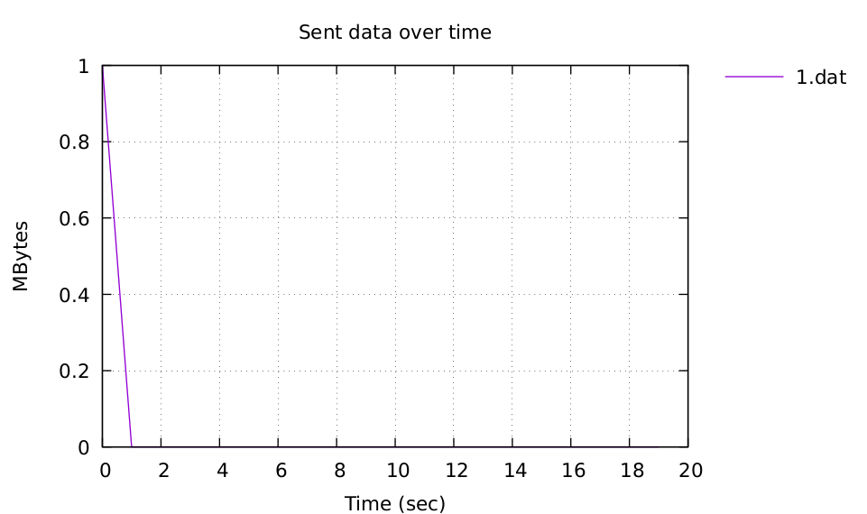

# Измерение характеристик сетевых соединений в Mininet

## Указания к работе

Описание выполнения установки приведено для техники со следующими характеристиками:

- ОС ubuntu-20.04.3 (https://ubuntu.com).
- AMD Ryzen 7 3700X 3600 MHz, 4Гб оперативной памяти, 20Гб свободно на SSD.

Для выполнения работы требуется следующее программное обеспечение:

- mininet (http://mininet.org/)
- gnuplot (http://www.gnuplot.info/)
- python 3.8 (https://www.python.org/)
- pip (https://pypi.org/project/pip/)
- iperf3 (https://iperf.fr/)
- iperf3_plotter (https://github.com/ekfoury/iperf3_plotter)

## Выполнение работы

1. Перейдем в директорию src.
2. Файл main.py запускает симуляцию, подгружая модули Model и Monitor. Model формирует нашу исследуемую модель, а Monitor включает мониторинг некоторых характеристик сети. В симуляции запускается метод iperf_output(interface, interval_sec, filename) и monitoring_qlen(client, server, params,  filename). 
3. Сделаем файл plot_qlen исполняемым.

```bash
chmod +x plot_qlen
```

4. Например, у нас имеется 2 узла (h1, h2) и коммутатор (s1), к которому они подключены (изменять исходные данные можно в файле Model.py). Мы хотим исследовать соединение s1-eth1 и посмотреть характеристики передавачи данных от узла h1 до h2. Запустим симуляцию.

```bash
sudo python3.8 main.py
```

5. В рабочей директории создались файлы file.json и qlen.txt. В данных файлах содержаться характеристики исследуемой сети. 
6. Запустим скрипты для создания графиков характеристик сетевых соединений. 

```bash
plot_iperf.sh file.json & ./plot_qlen 
```
7. Сформированный файл queue.pdf - это график роста очереди со временем.


8. В директории result находятся графики следующих характеристик сетевого соединения: количество переданных данных, CWND, MTU, ретрансляция данных, RTT, RTT Var, пропускная способность.




