# Измерение характеристик сетевых соединений в Mininet

## Указания к работе

Описание выполнения установки приведено для техники со следующими характеристиками:

- ОС ubuntu-20.04.3 (https://ubuntu.com).
- AMD Ryzen 7 3700X 3600 MHz, 4Гб оперативной памяти, 20Гб свободно на SSD.

Для выполнения работы требуется следующее программное обеспечение:

- mininet (http://mininet.org/)
- gnuplot (http://www.gnuplot.info/)
- python 3.8 (https://www.python.org/)
- pip (https://pypi.org/project/pip/)
- iperf3 (https://iperf.fr/)
- iperf3_plotter (https://github.com/ekfoury/iperf3_plotter)


## Описание топологии сети

Далее в работе мы будем использовать сеть со следующей топологией:

- 2 узла (h1 и h2 с адресами 10.0.0.1 и 10.0.0.2 соответственно);
- коммутатор s1;
- 2 соединения (h1-s1 и s1-h2) со следующими характеристиками:
    - пропускная способность равна 100Мбит/с;
    - задержка распространения сигнала между узлами равна 25мс;
    - процент потерь пакетов на соединении равен 1%;
    - максимальная буферная память равна 50 пакетам.

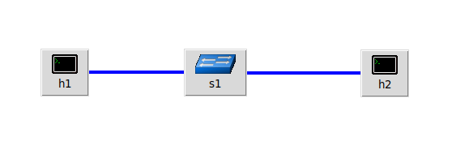

**Model.py** - файл моделируем топологии. В данном файле следующие строки

```python
host1 = self.addHost('h%s' % 1)
host2 = self.addHost('h%s' % 2)
switch1 = self.addSwitch('s%s' % 1)
```

отвечают за создание 2-х хостов и свича, а строки

```python
self.addLink(host1, switch1, cls=TCLink, bw=100, delay='25ms', loss=1, max_queue_size=50)
self.addLink(host2, switch1, cls=TCLink, bw=100, delay='25ms', loss=1, max_queue_size=50)
```

## Выполнение работы

1. Перейдем в директорию src.
2. Файл **main.py** запускает симуляцию, подгружая модуль **Model**. В функции **simulation** происходит симуляция работы нашей сети. Данную функцию мы вызываем в главной функции **main**. Следующие строки в файле **main.py**.

```python
topology = OwnTopology()
net = Mininet(topo=topology, host=CPULimitedHost, link=TCLink)
```

создают объект **topology**, который передается параметром в объект **net** класса **Mininet**, тем самым инициализируя нашу топологию. Далее мы будем работать только с объектом **net**. Методы **start** и **stop** класса **Mininet** отвечают за старт сети и ее завершение соответственно. **CLI(net)** запускает сеть в режиме CLI.


3. Перейдем в директорию src. Сделаем файлы **qlen_monitor** и **plot_qlen** (директория monitoring) исполняемым.

```bash
cd src
chmod +x qlen_monitor
chmod +x monitoring/plot_qlen
```

4. Запустим нашу сеть командой

```bash
sudo python3.8 main.py
```

5. Откроем дополнительный терминал и запустим скрипт для мониторинга очереди **qlen_monitor**.

```bash
./qlen_monitor s1-eth1 0.1 qlen1.txt
```

Первый параметр - имя сетевого соединения, которое мы хотим рассмотреть, второй параметр - частота, с которой мы будем делать измерение, третий параметр - файл, в который будет производиться запись.

6. Подождем пару секунд и с помощью сочетания клавиш Ctrl+C завершим работу скрипта. Посмотрим на содержимое файла.

```bash
cat monitoring/qlen1.txt
```

В данном файле столбец 1 отвечает за время замеров очереди, а столбец 2 за фактическое значение очереди. Сейчас все значения второго столбца равны нулю.

7. В CLI откроем терминалы для хостов h1 и h2. 

```bash
xterm h1 h2
```

8. Запустим iperf3-сервер на хосте h2.

```bash
iperf3 -s
```

9. Запустим iperf3-клиент на хосте h1.

```bash
iperf3 -c 10.0.0.2 -t 20 -J > monitoring/data.json
```

iperf3 генерирует данные и по протоколу TCP отправляет их на iperf3-сервер. Параметр t отвечает за время работы соединения, а J за генерацию файла формата json, в котором будут содержаться характеристики передачи данных.

10. Одновременно с запуском iperf3-клиента запустим **qlen_monitor**. Остановим qlen_monitor, как только iperf3-клиент завершит работу

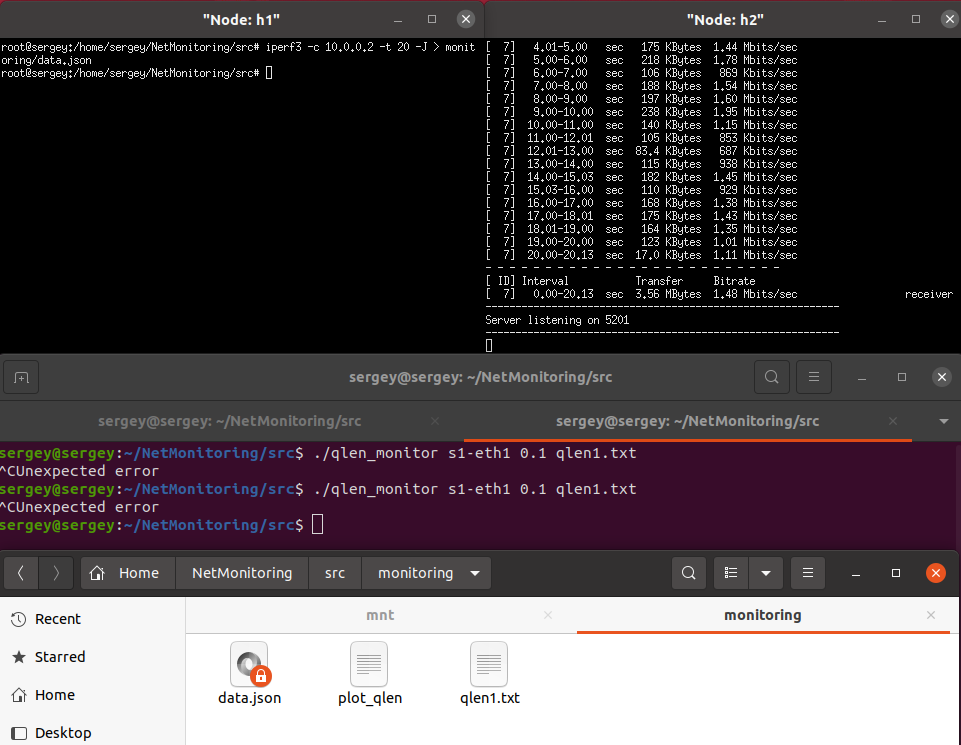

11. Запустим **plot_qlen** и **plot_iperf.sh** для вывода данных в графическом представлении.

```bash
cd monitoring
plot_iperf.sh data.json && gnuplot -c plot_qlen qlen1.txt qlen1.pdf
```

Параметрами для скрипта **plot_qlen** являются файл с данными очереди и имя файла, который будет сгенерирован.

В результате выполнения скриптов создается файл qlen1.pdf и директория result, в которой находятся все данные, снятые с iperf3.


12. Рассмотрим полученные графики. 

- queue_plot.pdf - график, на котором показаны размер очереди в некоторый момент времени. Видим, что очередь сравнительно небольшая (в пике 9 пакетов), хотя и это значение влияет RTT. 

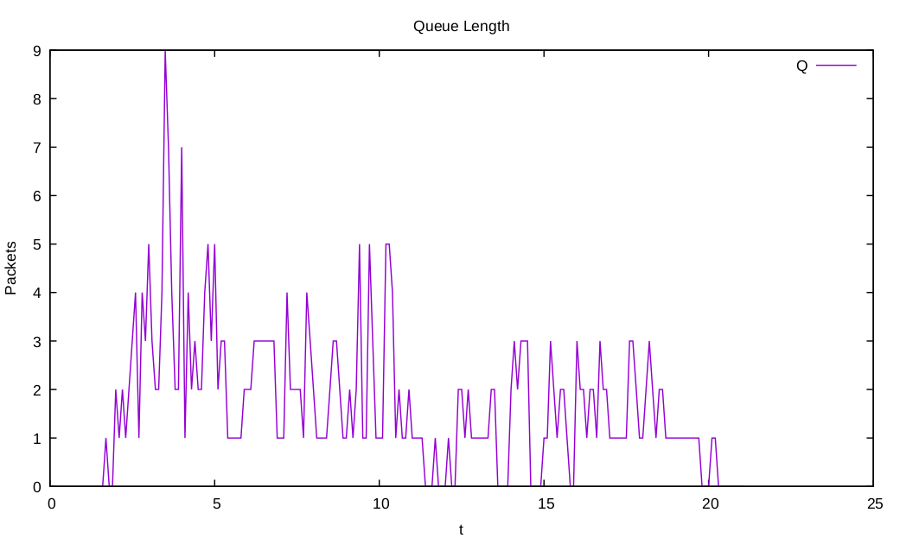

- cwnd.pdf - график, который показывает значение окна перегрузки. Видим, что окно не может найти свое оптимальное значение, так как в параметрах соединения указана высокая частота потерь пакетов. 

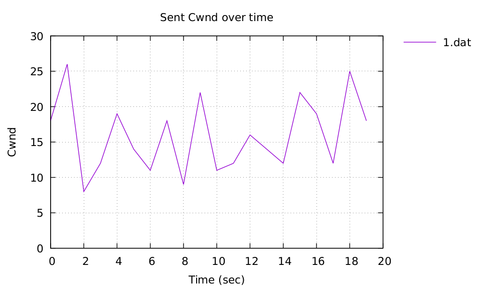

- MTU.pdf - график значения максимальной длины пакета. Видим, что значение mtu - константа, которая равна 1500 байт.

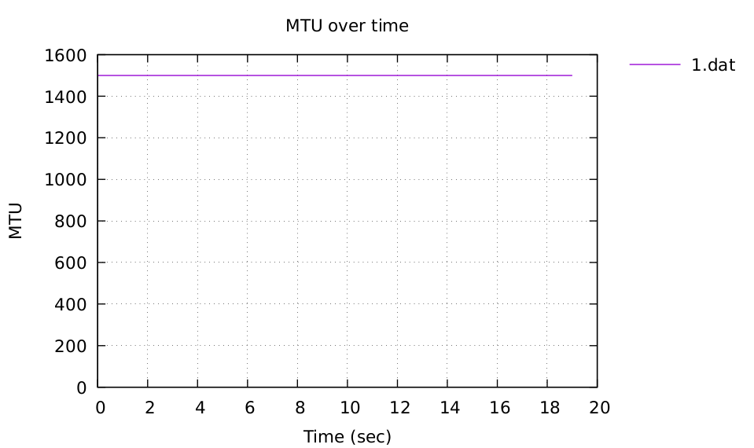

- retransmits.pdf - график значения количества повторно переданных пакетов. Видим, что максимальное количество повторно переданных пакетов равно 8. Повторная передача связана с потерями в сети, а шанс потери пакета, как мы задавали в модели, равно 1%.

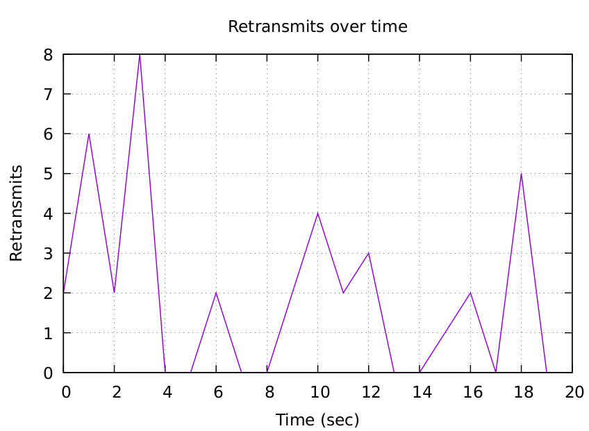

- RTT.pdf - график значения RTT (в микросекундах). На значение RTT влияет задержка распространения сигнала в сети и значение очереди. Видим, что RTT колеблется в пределах от 100мс до 160мс.

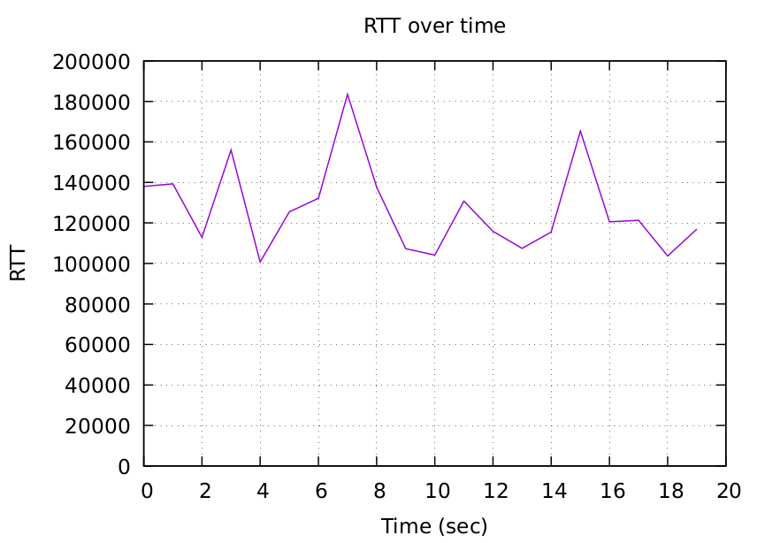

- RTT.pdf - график изменения RTT. Видим, что RTT достаточно резко повышается и понижается в некоторых промежутках времени.

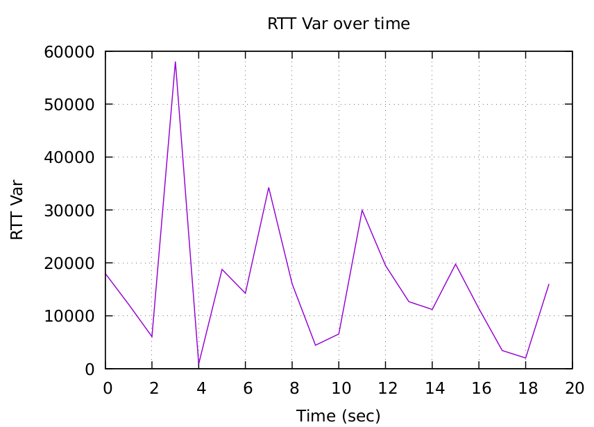

- throughput.pdf - график значения пропускной способности Видим, что скорость колеблется от 0 до 5МБ, что очень мало для сети, с заявленой пропускной способностью 100МБ.

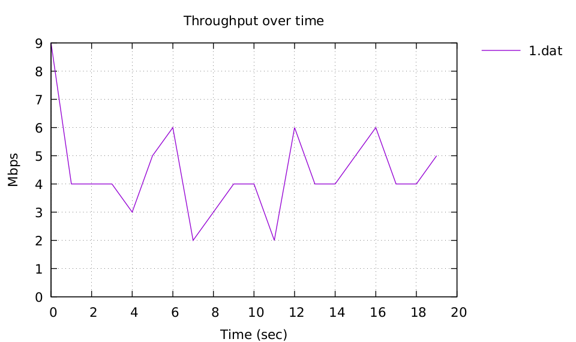

13. Изменим данные в модели. Остановим CLI с помощью команды **exit** и откроем файл Model.py. Заменим строки 

```python
self.addLink(host1, switch1, cls=TCLink, bw=100, delay='25ms', loss=1, max_queue_size=50)
self.addLink(host2, switch1, cls=TCLink, bw=100, delay='25ms', loss=1, max_queue_size=50)
```
на 

```python
self.addLink(host1, switch1, cls=TCLink, bw=50, delay='25ms', loss=0.01, max_queue_size=50, use_tbf=True)
self.addLink(host2, switch1, cls=TCLink, bw=50, delay='25ms', loss=0.01, max_queue_size=50, use_tbf=True)
```

Здесь мы уменьшаем полосу пропускания пакетов до 50МБ, уменьшаем количество потерь до 0.01%. Помимо этого мы включаем tbf (алгоритм, который гарантирует некоторую скорость передачи данных). Сохраняем файл, запускаем сеть и проделываем инструкции с 7 по 11 пункт. 

14. Рассмотрим как изменилось поведение нашей сети. Здесь нас интересует значение очереди

- Значение cwnd значительно увеличилось из-за того, что количество потерянных пакетов в сети уменьшилось до 0.01%, что в свою очередь дает больший прирост количества передаваемых данных. 

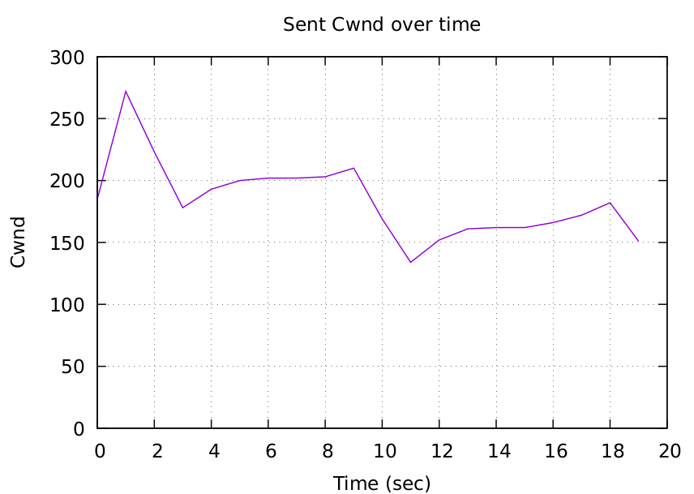

- Количество повторно переданных пакетов стало меньше. Связано это с уменьшением количества потерь на линии связи.

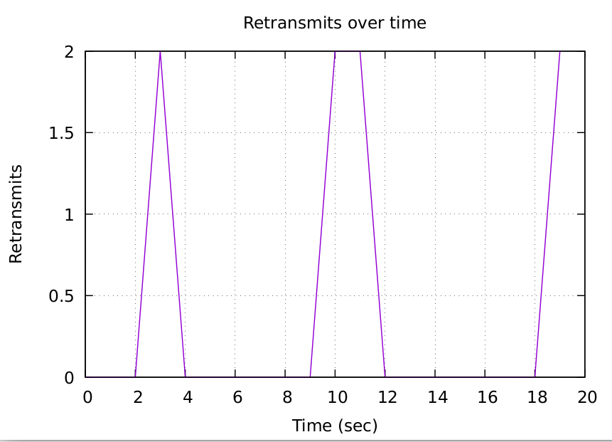

- Пропускная способность сильно увеличилась (благодаря уменьшению потерь) и стала стабильной (благодаря включению tbf).

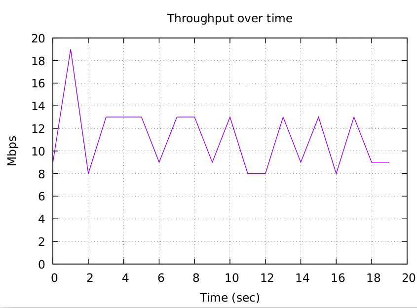

- Размер очереди сильно изменился из-за того, что количество пакетов, приходящих на коммутатор, резко увеличилось в сравнении с первым опытом. 

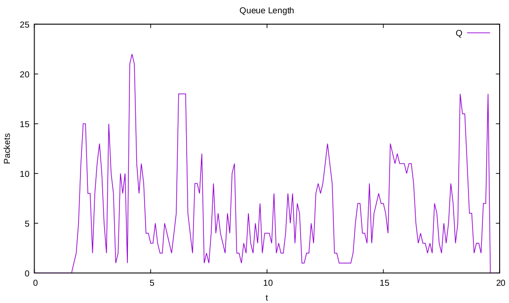