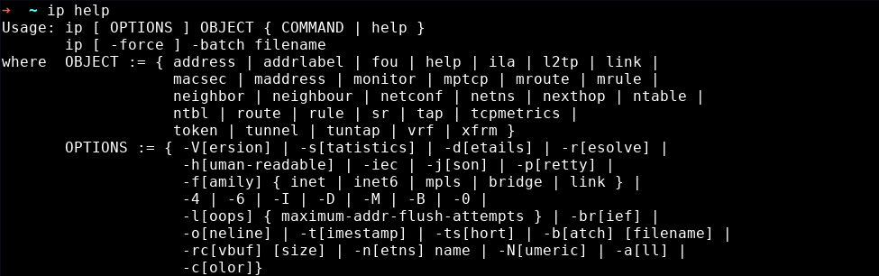
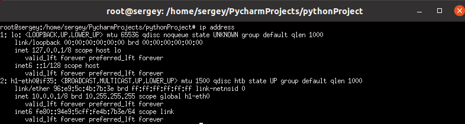
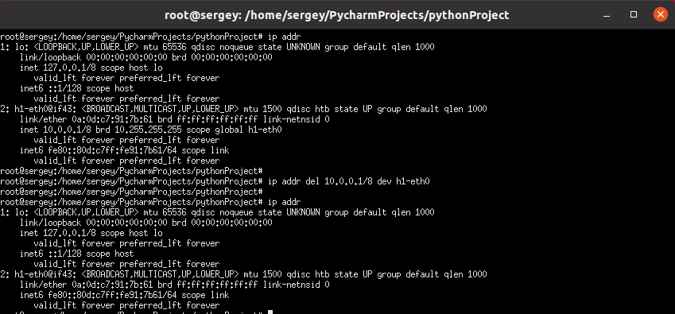
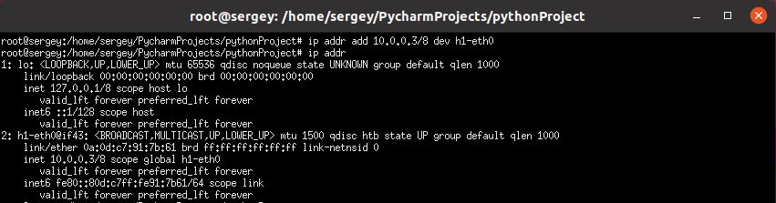
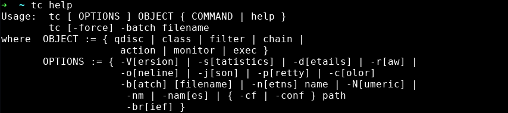
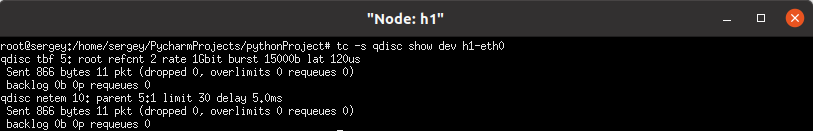
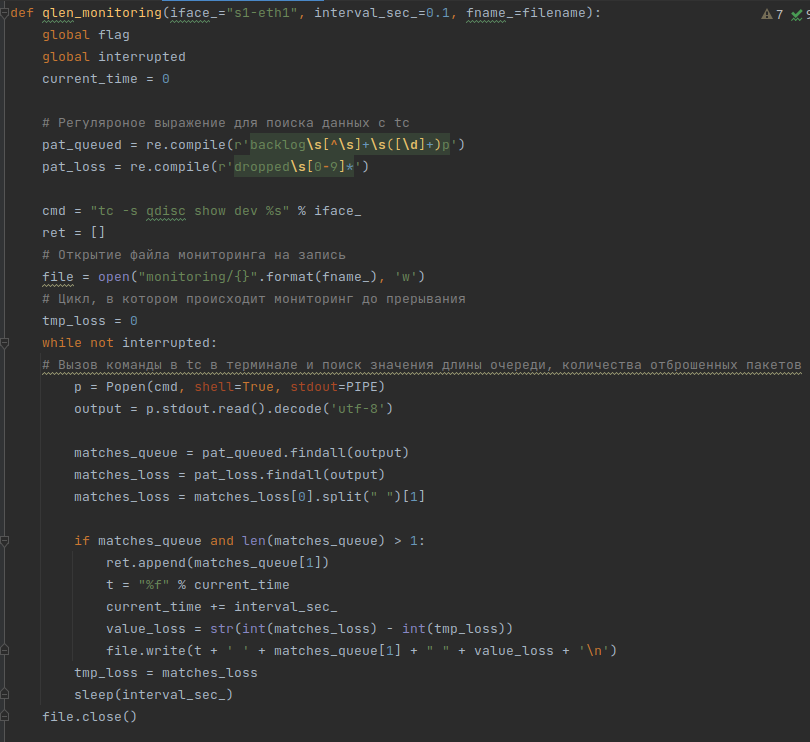

# iproute 2

## Введение

iproute2 — это набор утилит для управления параметрами сетевых устройств в ядре Linux. Эти утилиты были разработаны в качестве унифицированного интерфейса к ядру Linux, которое непосредственно управляет сетевым трафиком.

iproute2 заменил полный набор классических сетевых утилит UNIX, которые ранее использовались для настройки сетевых интерфейсов, таблиц маршрутизации и управления arp‐таблицами: ifconfig, route, arp, netstat и других, предназначенных для создания IP‐туннелей. iproute2 предлагает унифицированный синтаксис для управления самыми разными аспектами сетевых интерфейсов.

Набор утилит включает в себя три основные программы:

- ip — утилита для просмотра параметров и конфигурирования сетевых интерфейсов, сетевых адресов, таблиц маршрутизации, правил маршрутизации, arp‐таблиц, IP‐туннелей, адресов multicast рассылки, маршрутизацией multicast пакетов.
- tc — утилита для просмотра и конфигурирования параметров управления трафиком. Позволяет управлять классификацией трафика, дисциплинами управления очередями для различных классов трафика либо целиком для сетевого интерфейса, что, в свою очередь, позволяет реализовать QoS в нужном для системы объёме: 
    - разделение разных типов трафика по классам;
    - назначение разных дисциплин обработки очередей трафика с разным приоритетом, механизмами прохождения очереди, ограничениями по скорости и т. п.
- ss — утилита для просмотра текущих соединений и открытых портов. Аналог утилиты netstat.

## Использование утилиты ip

Для выполнения какой-либо операции после команды ip указывается «объект» и команда (возможно с аргументами), которая должна быть выполнена для этого объекта. В качестве «объектов» можно указывать значения link, addr (адреса сетевых интерфейсов), route (маршруты), rule (правила), neigh, ntable, tunnel (тоннели), maddr, mroute, monitor, xfrm.

Для получения полного списка опций, команд, объектов используйте 

```bash
ip help
```



С помощью утилиты ip посмотрим ip-адрес и mac-адрес узла h1.

```bash
ip addr
```



Удалим адрес узла h1 и посмотрим на изменение.

```bash
ip addr del 10.0.0.1/8 dev h1-eth0
```



Добавим ip-адрес 10.0.0.3 узлу h1.


```bash
ip addr add 10.0.0.3/8 dev h1-eth0
```




## Использование утилиты tc

Данная утилита наиболее полезна нам, так как она позволяет гибко настроить поведение контроля исходящего трафика. Система контроля трафика состоит из:

- Ограничения исходящего трафика (SHAPING). Когда трафик сформирован, его полоса пропускания начинает контролироваться. Ограничение может дать больше, чем уменьшение полосы пропускания - оно также используется для сглаживания пиков для более прогнозируемого поведения сети.
- Планирования передачи пакетов (SCHEDULING). Это позволяет увеличить интерактивность исходящего трафика при гарантировании полосы пропускания для передачи данных большого объема. Такое упорядочение также называется приоритезацией и применяется для исходящего трафика.
- Ограничения исходящего трафика (POLICING). Этот
механизм позволяет ограничить количество пакетов или байт в потоке входящего трафика, соответствующих определенной классификации.
- Отбрасывания (DROPPING). Трафик, превышающий установленную полосу пропускания, может быть отброшен как для входящего, так и исходящего трафика.
Обработка трафика контролируется тремя типами объектов: очередями (qdiscs), классами и фильтрами.

Данная утилита наиболее полезна нам, так как она позволяет гибко настроить поведение контроля исходящего трафика. 

Для информации о tc используйте

```bash
tc help
```



С помощью tc выведем информации о состоянии очереди на сетевом устройстве h1-eth0.

```bash 
tc -s qdisc show dev h1-eth0
```



В выводе команды имеется информация о типе очереди, о пропускной способности, количестве отправленных байт данных, количестве пакетов, количестве отброшенных пакетов, количестве пакетов в очереди, максимальном размере очереди, задержке. Собственно, те параметры сетевого соединения, которые мы указали в моделе, можно увидеть здесь. Этот вывод дает нам так же возможность просмотреть поведение очереди в разные моменты времени, собственно, чем мы и воспользовались при мониторинге длины очереди в файле qlen_monitor. С помощью регулярного выражения мы отделили длину очереди от остального потока данных и записали эту длину в файл. Изменим немного файл qlen_monitor для того, чтобы помимо очереди мы могли отслеживать количество отброшенных пакетов. 

Изменим функцию qlen_monitor.



Теперь наш qlen_monitor может отслеживать количество отброшенных пакетов. Данные записываются третьей строкой в файл, который мы указываем в параметре.

Также с помощью tc мы можем задавать различные параметры сетевых соединений. Например с помощью команды 

```bash
tc qdisc add dev h1-eth0 root netem delay 100ms loss 50%
```

мы задаем задержку 100ms и количество потерь пакетов 50%.

## Утилита ss

ss используется для вывода статистики сокета в формате netstat. Например:
- Список установленных в настоящее время, закрытых, потерянных и ожидающих сокетов TCP:

```bash
ss -s
```

- Отобразить все открытые сетевые порты:

```bash
ss -l
```

- Просмотреть имя процесса с использованием открытого сокета:

```bash
ss -lp | grep PID
```

- Показать все UDP-сокеты

```bash
ss -u -a
```

- Получить информацию о возможностях утилиты ss:

```bash
ss -help
```