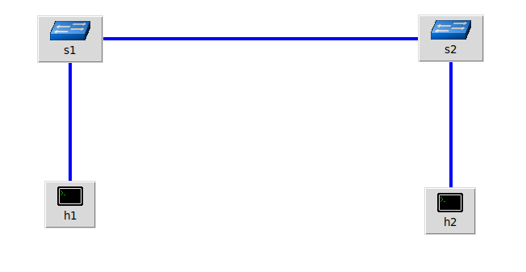

## Модель сети

h1-s1:

100 mbit, delay = 30ms +- 7, loss = 0.01%

s1-s2:

100 mbit, delay = 30ms +- 7, loss = 0.01%

s2-h2:

50 mbit, delay = 30ms +- 7, loss = 0.01%

## TCP BBR + pfifo

### Команды tc для сетевых устройств

Для h1: 

sysctl -w net.ipv4.congestion_control=bbr

Для h2: 

sysctl -w net.ipv4.congestion_control=bbr

Для s1:

sudo tc qdisc replace dev s1-eth2 root handle 10: tbf rate 100mbit burst 50000 limit 150000

sudo tc qdisc replace dev s1-eth1 root handle 10: tbf rate 100mbit burst 50000 limit 150000

sudo tc qdisc add dev s1-eth1 parent 10: handle 20: netem loss 0.01% delay 30ms 7ms distribution normal

Для s2:

sudo tc qdisc add dev s2-eth2 root handle 10: netem loss 0.01% delay 30ms 7ms distribution normal

sudo tc qdisc replace dev s2-eth2 parent 10: handle 20: tbf rate 50mbit burst 25000 limit 75000

sudo tc qdisc add dev s2-eth2 parent 20: handle 30: pfifo limit 30

sudo tc qdisc replace dev s2-eth1 root handle 10: tbf rate 100mbit burst 50000 limit 150000

sudo tc qdisc add dev s2-eth1 parent 10: handle 20: netem loss 0.01% delay 30ms 7ms distribution normal

ПЕРЕДАНО: 297 Mbytes BITRATE: 41.5Mbit/sec

### TCP BBR + RED

## Команды tc для сетевых устройств

Для h1: 

sysctl -w net.ipv4.congestion_control=bbr

Для h2: 

sysctl -w net.ipv4.congestion_control=bbr

Для s1:

sudo tc qdisc replace dev s1-eth2 root handle 10: tbf rate 100mbit burst 50000 limit 150000

sudo tc qdisc replace dev s1-eth1 root handle 10: tbf rate 100mbit burst 50000 limit 150000

sudo tc qdisc add dev s1-eth1 parent 10: handle 20: netem loss 0.01% delay 30ms 7ms distribution normal

Для s2:

sudo tc qdisc add dev s2-eth2 root handle 10: netem loss 0.01% delay 30ms 7ms distribution normal

sudo tc qdisc replace dev s2-eth2 parent 10: handle 20: tbf rate 50mbit burst 25000 limit 75000

sudo tc qdisc replace dev s2-eth2 parent 20: handle 30: red limit 60Mbit avpkt 1000 probability 0.1 bandwidth 100Mbit

sudo tc qdisc replace dev s2-eth1 root handle 10: tbf rate 100mbit burst 50000 limit 150000

sudo tc qdisc add dev s2-eth1 parent 10: handle 20: netem loss 0.01% delay 30ms 7ms distribution normal

red настройка вычисляются следующим образом:

min = (задержка)*bandwidt(bits/s), 

burst= (2*min+max)/(3*avpkt)), 

limit= 10*max, 

max > 2*min, 

avpkt 1000

ПЕРЕДАНО: 329 Mbytes BITRATE: 45.9Mbit/sec

