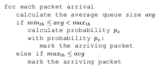
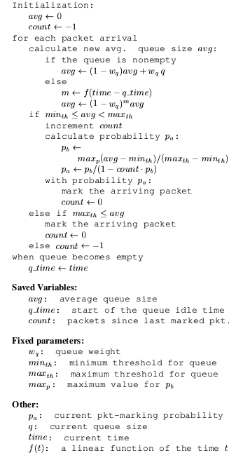

# Random Early Detection Gateways for Congestion Avoidance

## Abstract

Данный документ описывает принцип построения алгоритма RED, работающем на шлюзах, который позволяет эффективно работать с перегрузками в сети с пакетной коммутацией. Шлюз определяет зарождающуюся перегрузку благодаря вычислениям средней длины очереди. Шлюз предупреждает соединения о перегрузке отбрасыванием пакетов или же помечая бит данных в хедере пакета. Когда средний размер очереди превышает заданный порог, тогда пакеты отбрасываются или маркируются с определенной вероятностью, которая высчитывается по функции из среднего размера очереди.

Шлюзы с технологией RED сохраняют средний размер очереди низким, допуская резкий наплыв пакетов в очередь. Во время перегрузки вероятность того, что шлюз потребует конкретное соединение уменьшить размер окна, пропорциональна доле пропускной способности этого соединения через шлюз. Алгоритм RED спроектирован для сопровождения протоколов транспортного уровня, которые работают с перегрузкой, например TCP. Алгоритм RED лояльно относится к резким скачкам трафика и избегает синхронного уменьшения окон TCP каждого соединения. Оценка производительности алгоритма приведена в симуляции работы сети TCP/IP.

## Introduction

В современной сети Интернет транспортный протокол TCP оповещает о произошедшей перегрузке только наличием отброшенного пакета на шлюзе. Это не является хорошим поведением, ибо при возникновении длинных очередей на шлюзах заметно увеличивается средняя задержка передачи пакетов. Так, в современных сетях требуется механизм, который позволит иметь высокую пропускную способность и малый размер очереди.

Существует ряд механизмов, который позволяет поддерживает низкую задержку в сети и высокую пропускную способность при отсутствии явной обратной связи от шлюза. Все эти механизмы завязаны на каждом конкретном соединении с достаточно малым количеством исходных данных: изменение пропускной способности, увеличение задержки, потеря пакетов и тд. Более эффективно вычислять перегрузки возможно непосредственно на шлюзах.Только у шлюза есть полная информация о поведении очередей на всем временном промежутке, поэтому решение о назначении характеристик передачи данных лучше предоставить шлюзу, нежели конкретному соединению.

Методы мониторинга существуют из предположений, что у нас есть очередь, в которую поступают пакеты, причем очередь работает по принципу FIFO, и соединения, которые генерируют эти пакеты. Важно заметить, что не только FIFO используется для работы с очередями, просто FIFO легко расширять и легко реализовать. В данной статье речь пойдет об алгоритме RED, который и решает какому соединению просигнализировать о факте перегрузки.

RED предназначен для сетей, в которых отброс пакета или его маркировка сигнализирует об перегрузке.

## Previous work on congestion avoidance gateways

### Early Random Drop gateways

Early Random Drop является предтечьем к появлению RED. Алгоритм работы ERD следующий: если размер очереди превышает определенный уровень (drop level), то шлюз начинает сбрасывать приходящие пакеты с фиксированной вероятностью (drop probability), причем происходить это должно с учетом сетевого трафика и drop level вместе с drop probability должны изменяться динамически.

Некоторый Хашем (он же ученый) указывает, что Drop Tail сбросом пакета производит глобальную синхронизацию всех соединений путем сброса окон перегрузки, тем самым заметно понижая пропускную способность сети. 

Пример, приведенный в статье показывает, что данная технология плохо справлялась с предотвращением перегрузок. Главной целью алгоритма было: "единообразная, динамическая обработка пользователей, низкие накладные расходы и хорошие характеристики масштабирования в больших и загруженных сетях", однако достигнуть ее так и не удалось.

### Other approaches to gateway mechanisms for congestion avoidance

Ранние спецификации IP Source Quench messages предлагали шлюзы отсылать сообщения (Source Quench messages) хостам еще до того, как исчерпается буфер или шлюз отбросит пакет. Это означает, что как только размер очереди превысит некоторое значение, отправляется Source Quench messages хосту и между ними происходит общение (любые пакеты кроме ICMP игнорируются).

Схема, описанная в документе [ingali, S., Tipper, D., and Hammond, J., “The Performance of Adaptive Window Flow Controls in a
Dynamic Load Environment”, Proc. of IEEE Infocom ’90, June 1990, pp. 55-62.] является наиболее простой в реализации схемой. Каждый шлюз имеет верхний порог UT, указывающий на перегрузку, и нижний порог LT, указывающий на условия легкой нагрузки. Информация о размерах очередей на шлюзах добавляется к каждому пакету. Источник увеличивает свое окно только в том случае, если длина всех очередей шлюза на пути ниже нижних пороговых значений. Если длина очереди превышает верхний порог для любой очереди на пути, то исходный узел уменьшает свое окно. Очевидно, что данная схема чувствительная к резким наплывам трафика. 

DECbit - механизм избежания перегрузок, которая работает с хедером пакета, устанавливая в нем нужные биты, которые и указывают на загруженность сети. Шлюз считает среднюю длину очереди (за время занятости + за время простоя + за текущее время занятости) и устанавливает бит в заголовке пакета, если это значение больше или равно 1. Если половина пришедших на хост пакетов имеют установленный бит, тогда происходит сброс окна в связи с выбранным алгоритмом перегрузки. 

Между DECbit и RED есть несколько существенных отличий:

- Первое отличие заключается в методе вычисления средней длины очереди. DECbit вычисляет среднюю длину за некоторое короткое меняющееся время, в то время как RED использует константное время. 

- Второе отличие заключается в выборе соединения для уведомления о перегрузке. DECbit маркирует первый обслуживаемый пакет на момент высчитывания очереди, а RED вычисляет нужный пакет псевдослучайно.

## Design guidelines

Эта секция повествует о целях, к которым стремятся при разработке алгоритма RED. Главная цель данного алгоритма - минимизация перегрузок сети. Помимо избегания перегрузок алгоритм еще должен избегать синхронного уменьшения окон перегрузок устройств, быть устойчивым к всплескам входящего трафика и поддерживать средний размер очереди в буферах шлюза.

Первоначальная задача механизма предотвращения перегрузок - определение места, где происходит нарастание количества генерируемого трафика. Так как непосредственно у шлюза имеется представление об устройствах, которые к нему подключены и вырабатывают трафик, о размере очереди в буферах, то поиск места перегрузки не является сложной задачей. 

Далее шлюз должен определить какому устройству отправить оповещение о перегрузке. Для этой цели RED использует функцию, которая случайным образом выбирает пакет для маркировки. Способом оповещения может быть установка определенного бита в шапке пакета или отбрасывание пакета. Оба механизма в рамках данной статьи служат сообщениями источнику о перегрузке. 

## Design guidelines

Для вычисления длины очереди используется формула экспоненциально взвешенного скользящего среднего: 

$$
q_{k+1}^{^} = (1-w) q^{^}_{k} + wq_k, 
$$

Где $0 < w < 1$ - весовой коэффициент, $q_k$ - мгновенный размер очереди, $q^{^}_{k}$ - экспоненциально взвешенная скользящая средняя длина очереди. Данный метод позволяет быть лояльным к всплескам генерации трафика. 

Имея средний размер очереди (avg) мы можем написать следующий алгоритм: 

- Если avg меньше наперед заданного минимального порога, то пакеты не маркируются;
- Если avg больше наперед заданного максимального порога, то все пакеты маркируются;
- Если avg между минимальным и максимальным значением, то входящие пакеты маркируются с некоторой вероятностью ({p_a}). Таким образом, доля маркированых пакетов конкретного соединения пропорциональна доле его пакетов в шлюзе.

Псевдокод алгоритма можно видеть на рис. 1.

Таким образом, алгоритм можно разделить на 2 детерминированных действия. Первое действие - вычисление длины очереди, второе - вычисление вероятности с которой будет маркироваться поступающий пакет.

Полный псевдокод алгоритма можно видеть на рис. 2.

Вопросы, связанные с вычислением каждого параметра алгоритма будет обсуждаться далее в статье. 

## A simple simulation

В данной главе будет рассмотрена симуляция работы алгоритма RED. Характеристики симуляции следующие: у FTP-источника всегда есть пакеты для отправки, длина пакета фиксирована (1000 байт), ACK пакет отправляется от получателя в случае успешного приема пакета, приемник и источник содержат в себе реализацию алгоритма контроля перегрузок эквивалентную 4.3Tahoe BSD TCP. Сеть состоит из 4 источников и 1 приемника. Каждый источник генерирует от 33 до 112 пакетов. Параметры RED: $w_q=0002, min_{th} = 5, max_{th} = 15, max_p = 1/50$. Буфер приемника достаточно велик, чтобы пакеты не были отброшены по прибытию на шлюз. В данной симуляции RED контролирует размер очереди, который, фактически, в среднем равен сорока пакетам. 

Из графика 3 видно, что алгоритму успешно удается сохранять размер очереди в среднем значении. Ясно, что с увеличением количества узлов в сети частота сброса пакетов увеличиться.

## Calculating the average queue length

Алгоритм RED использует фильтр низкий частот для вычисления средней длины очереди.

### w_q

В статье дана формула для вычисления средней длины очереди, которая опирается на Exponential Moving Average. Формула выглядит следующим образом:

$$avg = (1 - w_q)avg + w_qq.$$

Далее, имея эту формулу можно считать avg для n-ных значений.

Чем меньше w_q, тем больше нужно входящих пакетов, чтобы avg реагировало на них, тем самым не фиксируется возможный момент перегрузки. В данной статье по большей части будет использоваться w_q = 0.002. 

### Setting min_th and max_th

Установка данных значений зависит от видов трафика и потребностей сети. Например, если трафик идет всплесками, тогда требуется чтобы min_th было достаточно большим, чтобы полностью утилизировать пакеты. Полезное правило стивить max_th = 2* min_th. 

## Calculating the packet-marking probability

Данная часть рассказывает об двух методах выбора функции, которая случайным образом маркирует пакет. В алгоритме используется второй метод, а именно:

$$p_b / (1-count*p_b),$$

где count - количество пакетов, которые не были замаркированы, и p_b:

$$p_b = p_max(avg - min_{th}) / (max_{th} - min_{th}). $$

## Evaluation of RED gateways

В данной части приводится оценка работы алгоритма.

- Congestion avoidance. Вообще не понял че хотели сказать авторы.
- Appropriate time scales. Время, необходимое на устранение перегрузки +- равно RTT.
- No global synchronization. RED маркирует пакеты в зависимости от уровня перегрузки. То есть, чем меньше зарождающаяся перегрузка, тем меньше шанс того, что все соединения получат маркированный пакет и произойдет глобальное уменьшение окон перегрузки. 
- Simplicity. Алгоритм RED может быть легко внедрен в сети текущего поколения (статья 90го года). 
- Maximizing global power. Как показано в прошлых частях RED имеет лучший показатель утилизации линии связи по сравнению с Drop Tail. 
- Fairness. Алгоритм пользуется случайной маркировкой, которая зависит от средней очереди и никоим образом не ориентирована на конкретное соединение. Однако, RED не может гарантировать одинаковую пропускную способность для каждого соединения. 
- Appropriate for a wide range of environments. RED подходит для широкого спектра сетей с разными скоростями, разными механизмами передачи данных и тд. 

### Parameter sensitivity

В отличии от Drop Tail, RED имеет параметры, конфигурация которых обязательна для каждого типа сети, т.к. это влияет на ее производительность. Далее идут некоторые советы по сеттингу параметров.

1. w_q => 0.001. если выбирается w_q меньше данного значения, тогда avg_q слабо реагирует на изменения в буфере и соответственно плохо реагирует на зарождающуюся перегрузку.
2. Ставить min_th достаточно высоким, чтобы сеть была устойчива к вспышкам трафика. Если верхний и нижний пороги будут низким, тогда сеть будет работать неэффективно.
3. Делать диапазон [min_th, max_th] достаточно широким, чтобы избегать глобальной синхронизации. Достаточно хорошее значение: max_th = 2*min_th.   

Далее в статье идет исследование модулируемой сети с большим количеством соединений и разнородностью трафика (от продолжительных связей до скачков трафика). Видно, что со скачками трафика RED дропает больше пакетов, нежели в случае с продолжительным соединением.