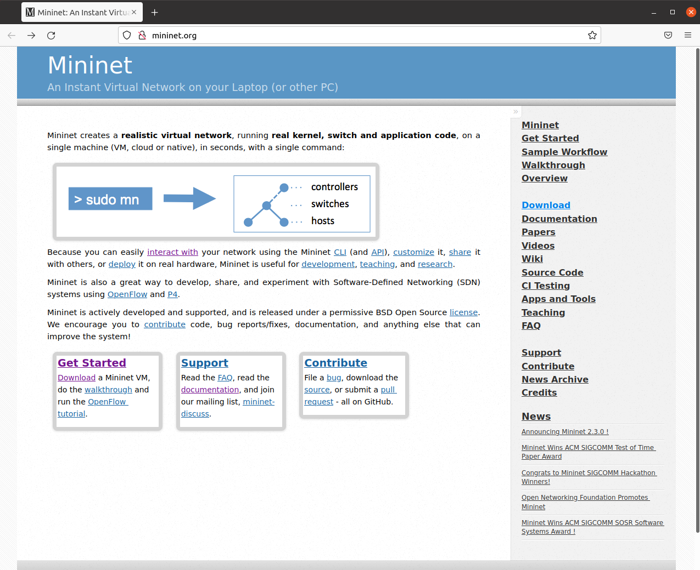
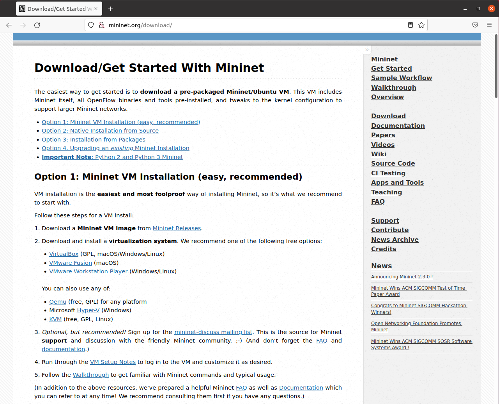
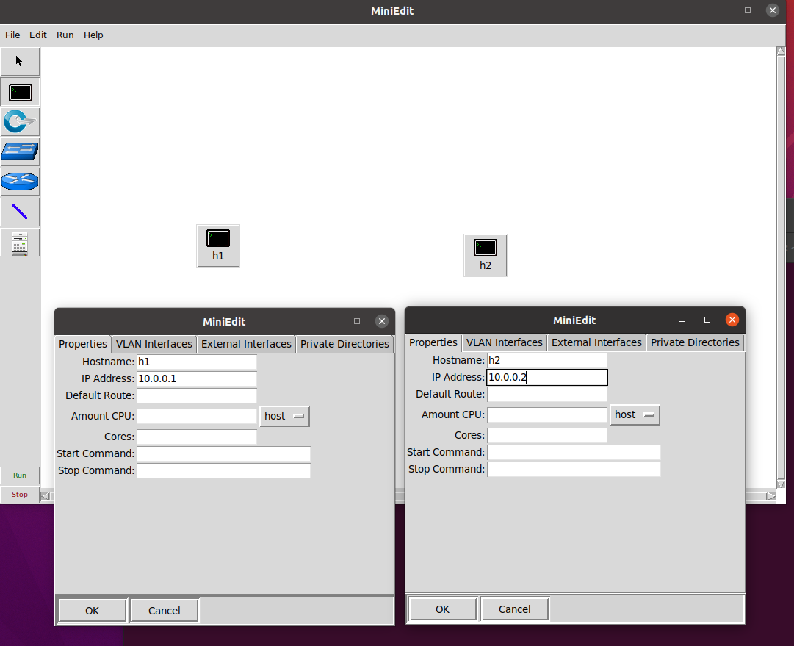
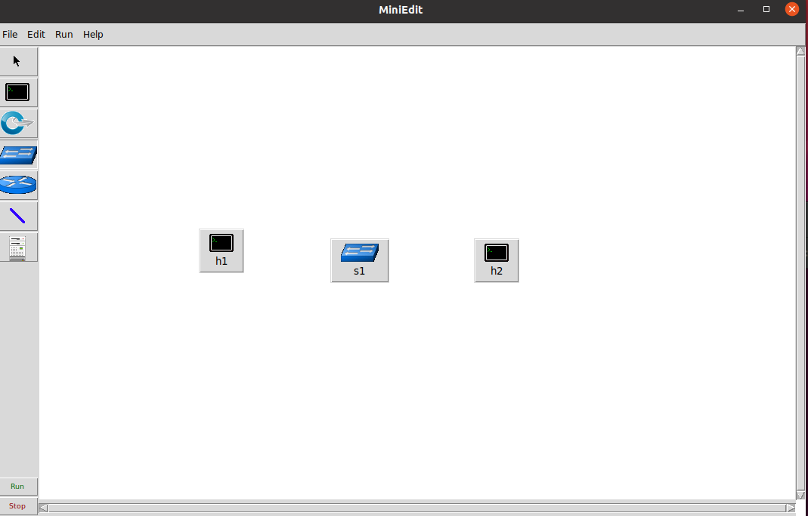
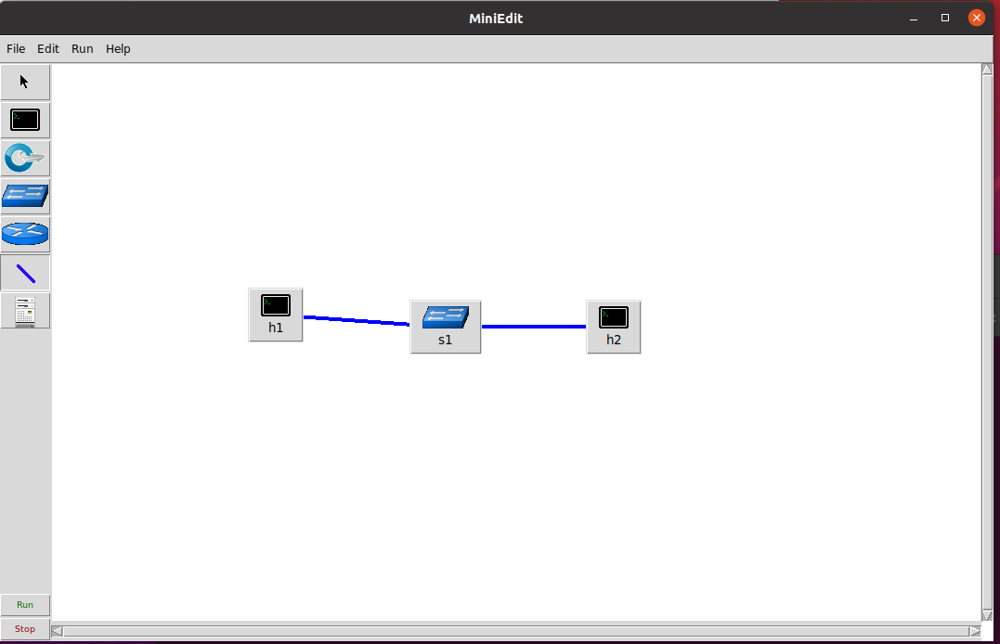
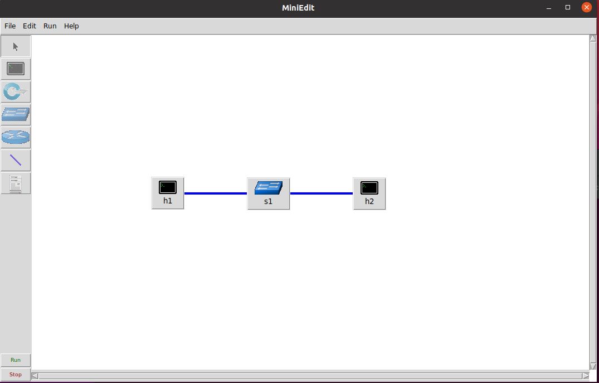
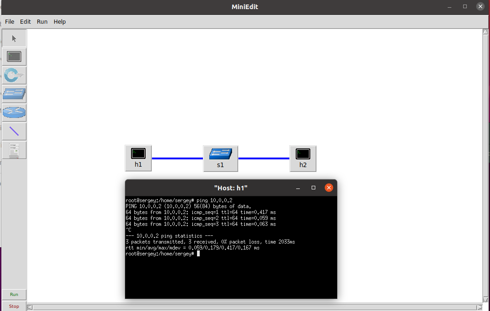
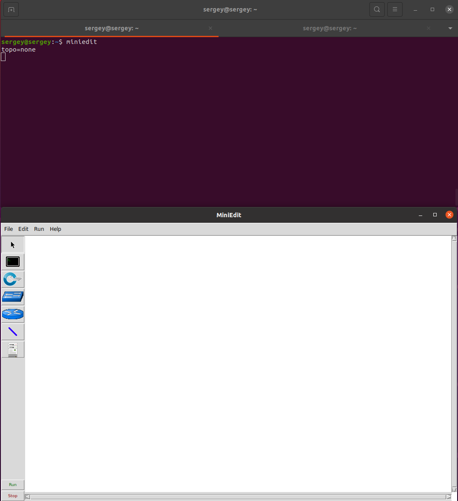

# Указания к установке

Описание выполнения установки приведено для техники со следующими характеристиками:
- ОС ubuntu-20.04.3 (https://ubuntu.com). 
- AMD Ryzen 7 3700X 3600 MHz, 4Гб оперативной памяти, 20Гб свободно на SSD.

# Установка

1. Зайдем на сайт Mininet mininet.org.



2. Перейдем в раздел Download и выберем режим установки mininet. Программа дает нам 3 опции по установке: установка образа по средствам github, установка из исходного кода на ПК или установка пакетом для ubuntu по средствам apt. Мы выбрали 2й вариант установки



3. Установим исходный код программы mininet и перейдем в установленную директорию. 

```bash
git clone git://github.com/mininet/mininet && cd mininet
```
4. Произведем установку программы mininet. 

```bash
./util/install.sh -a
```

Опция -a в команде означает, что мы хотим установить программу полностью со всеми зависимостями (например POX, Open vSwitch, OpenFlow).

После установки в директории /usr/local/lib/pythonV/dist-packages появится директория miniet.
5. Теперь мы можем запустить программу mininet.

```bash
sudo mn
```

Mininet требует права суперпользователя для запуска.

6. Удалим исходный код программы.

```bash
rm -rf mininet
```

7. Воспользуемся средством визуализации сети miniedit.

```bash
sudo python3 /usr/local/lib/python3.8/dist-packages/mininet/examples/miniedit.py
```

8. Проверим корректность работы программы. 
    - Создадим 2 хоста. 
    - Кликнув правой кнопкой мыши по хосту и выбрав раздел Properties зададим в поле Ip Adress адреса 10.0.0.1 и 10.0.0.2 соответственно.

        

    - Добавим в рабочую область коммутатор.

        

    - Соединим узлы сети.

        

    - Запустим симуляцию нажав на кнопку Run.

        

    - Откроем терминал первого хоста и отправим ping второму хосту.

        

    - Остановим симуляцию нажав на кнопку Stop.
9. Добавим alias для miniedit.

```
echo alias miniedit=\"sudo python3 /usr/local/lib/python3.8/dist-packages/mininet/examples/miniedit.py\" >> .bash_aliases
source .bash_aliases
```
10. Запустим miniedit из командной строки. 

